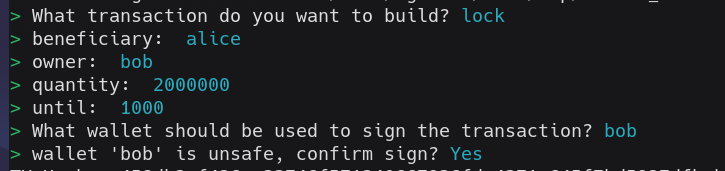

# Vesting example

A vesting contract is a common type of contract that allows funds to be locked for a period of time and unlocked later—once a specified time has passed. Typically, a vesting contract defines a beneficiary who may be different from the original owner.

In this example, an Owner address locks tAda that will be available for unlocking some time after the initial locking transaction, by either the Beneficiary stated in the datum or the Owner.

## Folder structure

```shell
.
├── offchain
│   ├── .env
│   ├── index.ts
│   └── protocol.ts
├── onchain
│   ├── validators
│   │  └── vesting.ak
│   ├── plutus.json
│   └── plutus.ts
├── main.tx3
└── README.md
```


In typical dApp fashion, there is an offchain and an onchain. In the `offchain` directory, we have the code related to building, signing and submitting the locking and unlocking transactions. In the `onchain` directory, we have the validator code that will be used to verify that the transaction is correct on the blockchain.

## Setup for the demo

To run this example we need the toolchain of tx3. You can set everything up following the [tx3up Quick Start Guide][1].
The validator compiled code is already included, but to make modifications, you'll need to install [Aiken][2].

We'll be running everything sitting in the [`src`](./) folder.
Once you've installed the tx3 toolchain, you'll run a local devnet for very fast transaction processing. Open a terminal and run:
```bash
$> trix devnet
```

To see what's actually going on in your devnet, run in a second terminal:
```bash
$> trix explore
```

You're now ready to start submitting transactions!.

<!-- 
We also need to make a `.env` file in the [`offchain` directory](./offchain/), with the following keys: -->
<!-- 
```shell
BENEFICIARY = "addr_test1..."
SEED_BENEFICIARY = "fade buddy legend ..."
``` -->

<!-- The `BENEFICIARY` key corresponds to a Cardano address, and the `SEED_BENEFICIARY` is the seed phrase for the Beneficiary. -->

## Lock vesting

In a different terminal, run the following command to lock funds in the Vesting contract:

```bash
$> trix invoke
```

Select the `lock` transaction providing the following parameters:
* **beneficiary**: alice
* **owner**: bob
* **quantity**: 200000
* **until**: 120000 (2 minutes)

Whose wallet do you think must be used for signing the transaction?.

If everything was done correctly, your CLI should look like this:



That's it! Now you can go to the terminal running the devnet explorer to see your transaction.

## Resources

Find more on the [Aiken's user manual](https://aiken-lang.org).

[1]: https://docs.txpipe.io/tx3/quick-start
[2]: https://aiken-lang.org